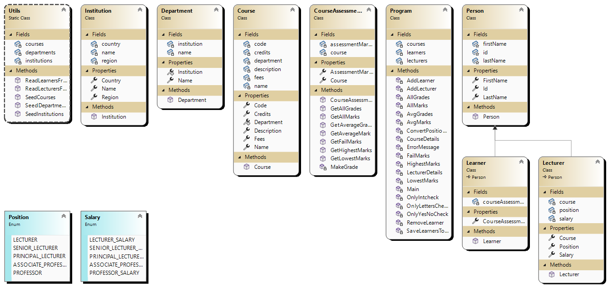

# Jenna Boyes 
## Project 1: Student Management System
This repo is intended for me to complete my assessment and to document the process.

## Using AI
Absolutely no use of AI generated answers will be used as I prefer the old school method of looking through forums etc. Below are all the searches I entered into Google to allow me to find the linked forum sites.

### "convert list int to list string c#"
- https://www.techiedelight.com/convert-list-of-int-to-list-of-string-in-csharp/
- I looked at the examples given and decided to test the `ConvertAll()` method
- I used the method to allow me to fill empty spots in a list with empty strings so it would show to console without throwing errors

### "iterate over enum c#"
- https://www.c-sharpcorner.com/article/loop-through-enum-values-in-c-sharp/
```
foreach (int i in Enum.GetValues(typeof(Colors)))
{
  Console.WriteLine($" {i}" );
}
```
- I used this code to showing all lecturer positions to console without hard coding them in


## Running Tests
To run tests, open StudentManagementSystemTestClass in Visual Studio. Right click the area where the code is, then click "Run Tests"

## Class Diagram
