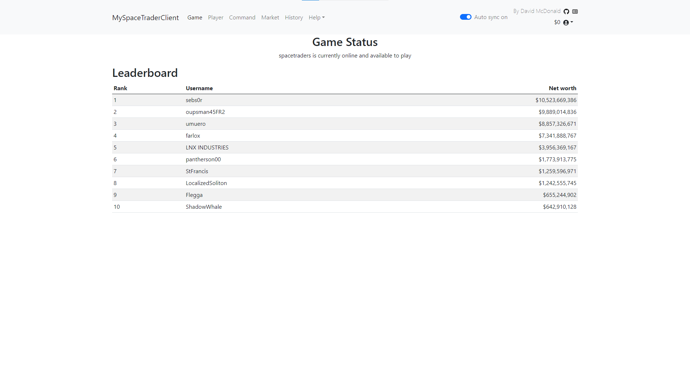
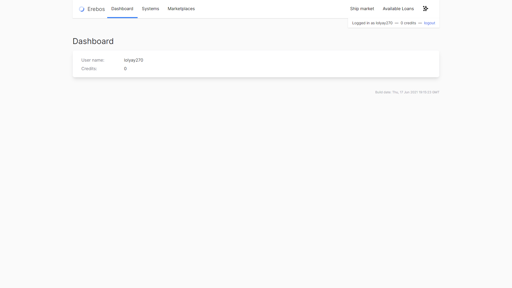
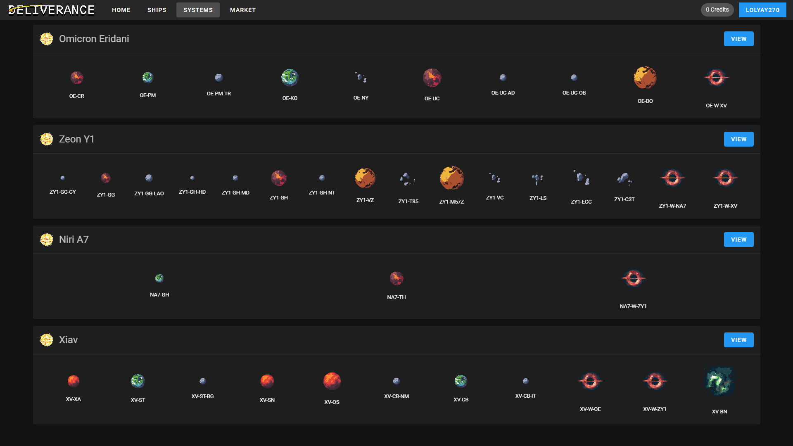
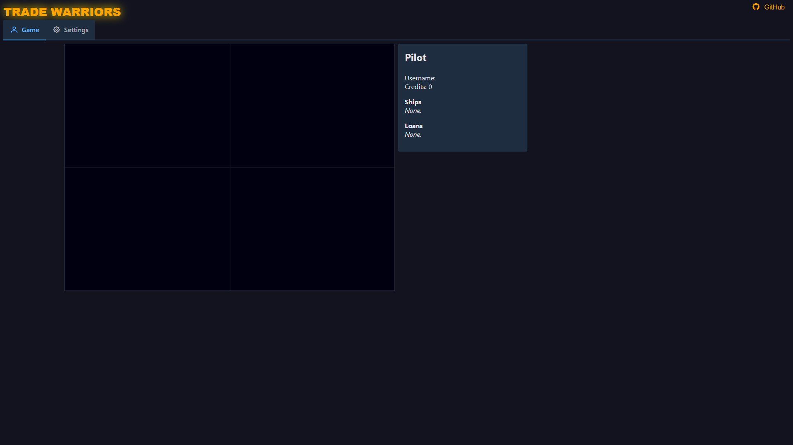

# Research Notes
## https://coruscating-longma-859850.netlify.app/#/game

### Pros (good things):
* When the player gets out a loan a message appears briefly in the corner of the window to confirm their actions were successful which is useful to know the player hasn't broken the game or needs to repeat the action.
### Cons (bad things):
* Leaderboard on the homepage is confusing and unnecessary
  * As a new, and returning, player, I don't necessarily want to see the leaderboard immediately
  * All I want to see is my info, what I can do and where I can go
* There is no explanation of what I can/need to do
  * There is an option to do things in different tabs, but the significance of those tabs and their features isn't obvious
* The player can't do anything without a ship and when they go to purchase a ship they don't have any money. This is fine, but they can't earn money through working straight away and need to take out a loan to continue.
This is, again, not obvious to the user and is confusing. Personally, I find it demotivating when I don't know what to do or how to figure it out.

## https://erebos.kaishi.de/

### Pros (good things):
* Homepage shows the username of the current agent logged in with their credits balance
* UX is nice, e.g.,
  * Nav bar top of screen: home and important links on the left, logout and extra features on the right
  * Spacing to give elements room to breathe
  * Loan tab located next to the ship market as well as a credit count, indicates to the agent they may need a loan for a ship
* Pages it shows:
  * all of the available planetary systems and their important information,
  * all ships available on the marketplace,
  * loans available
* Loading icon in the top left of the page appears every 5 seconds to indicate to the player the site data is always up-to-date
* After a loan is taken out it appears on the homepage with the information of the loan and a `pay back` button
* Once a ship has been purchased, information about the ship appears on the homepage with a `route` button to send it to another system.
* Purchasing a second ship right after acquiring the first isn't possible and an error message with red highlights appears in the top right to alert the user
### Cons (bad things):
* Still no tutorial or help of any kind to guide new players
* The loan has a `rate` of 40, which isn't completely obvious to those who've never worked with interest. After taking a 200,000 credit, the amount to pay with interest is 280,000 credits thus the 40 stands for 40%
* Possibly due to the use of an older API implementation, purchasing fuel for the ship to travel out of its home system is impossible as the marketplace for fuel (and other items) doesn't work

## https://deliverance.forcookies.dev/#/

### Pros (good things):
* The landing page to login has nice transititons between the different `register`, `login` and `switch user` tabs. This not only impressed me but suggests to me that the overall site is well polished and gives me more motivation to continue using the site.
* Usernames typed in one tab are saved when another tab is clicked which is a nice QOL feature for those that may type their username into the wrong tab and need to change over.
* Market tab to show market info on the different systems shows a bright red error when accessing without a ship
* Systems tab has animations of rotating planets which immediately drew my attention
### Cons (bad things):
* Homepage is under development and some functionality is inaccessible

## https://thaurin.github.io/trade-warriors/

### Cons (bad things):
* The homepage seems to be trying to display agent details which don't exist.
* Login page is in a second tab which, from a UX standpoint, is pretty annoying. The login page being in a somewhat hidden location makes it harder for the user to start playing and might even deter them from doing so.
* The login page doesn't function properly and can't log into an agent. I assumed that maybe the token I was using might have been adjusted for a particular sites login, since the tokens can be quite lengthy. So, to at least give the site a fair chance, I went through the effort of creating a new agent manually which to my surprise didn't work either. Potentially broken due to implementing an older SpaceTraders API version?
