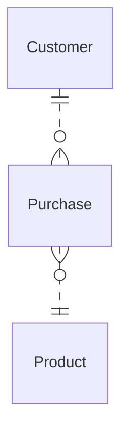

# Testing your understanding

## Exercise 6-1
- Change the optionality at the customer end of the relationship to O so not all
purchases need a customer.
- Leave the optionality as 1 but include a dummy customer object, with name
CashCustomer.
- Create subclasses of Customer: Cash_Customer and Account_Customer.
- Create subclasses of Purchase: Cash_Purchase and Account_Purchase.



## Exercise 6-2
```mermaid
erDiagram 
    borrower ||..|| Person : ""
    staff ||..|| Person : ""
    Person