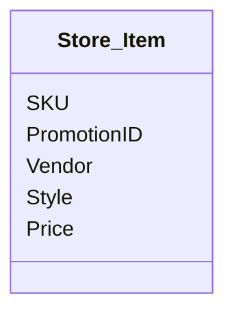

# Normalisation Exercises

## 1 - Choose a key and write the dependencies

Key is composite "Student_ID + Course# + Semester#"  
And the dependency is Grade

## 2 - What normal form is this relation in

Where:
- SKU, PromotionID -> Vendor, Style, Price
- SKU -> Vendor, Style

The above relation is first normal form

## 3 - Make the relation in 2, the next normal form
The next normal form is second normal form
I will make the primary key composite "SKU + PromoID + Vendor"

## 4 - What normal form is this relation in
- STUFF (***H***, ***I***, J, K, L, M, N, O)
- H, I -> J, K, L
- J -> M
- K -> N
- L -> O

2nd normal form since you can indirectly access all information from H and I combined

## 5 - Consider this relation
